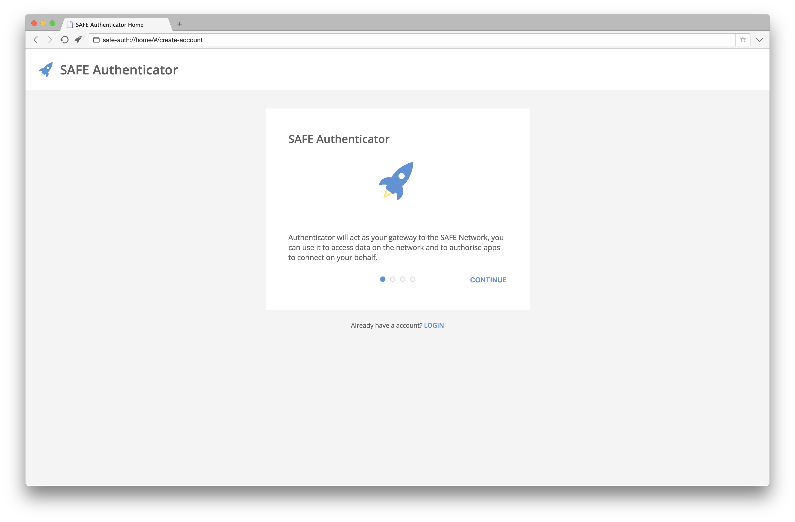

# SAFE Network

The SAFE Network is a decentralized data storage and communications network that provides a secure, efficient and low-cost infrastructure for everyone.

Rather than using data centers and servers which are prone to data theft and surveillance, the SAFE Network uses advanced peer-to-peer technology that joins together the unused hard drive space, CPU power and Internet connections of all SAFE users, creating a global network.

Users of the SAFE Network have full control over their data, while app developers can focus their time building on top of a secure infrastructure.

See [this page](https://maidsafe.net/features.html) for more information on the features of the SAFE Network.

## Getting Started

Users will (soon) be able to download the SAFE Browser in order to browse `safe://` websites and use SAFE web apps. The SAFE Browser will come with a built-in "SAFE Authenticator", which will allow users to create an account, login to their existing account and authorize applications.

SAFE Authenticator enables you to build SAFE Network apps that don't require users to give you access to their network credentials (their account secret and account password). This means users only have to share their network credentials with SAFE Authenticator and not with every app they use. Apps can interact with the SAFE Network directly once they have received authorization from SAFE Authenticator.

You can follow the instructions in the [safe_browser](https://github.com/maidsafe/safe_browser/tree/dev) repository to build a SAFE Browser binary that works with the mock network (a simulation of the SAFE Network).

We currently provide a client library called [SAFE App Node.js](https://github.com/maidsafe/safe_app_nodejs) for people who want to build apps with [Node.js](https://nodejs.org/). We also provide a DOM API (inside the SAFE Browser) for people who want to build web apps. We plan to maintain a few client libraries (e.g. Node.js, Java, Android, iOS, etc.) and let community members make client libraries for languages we don't officially support (e.g. Python, Go, Ruby, C#, etc.).

To get started with the Node.js and DOM APIs, you can take a look at the example apps in the [safe_examples](https://github.com/maidsafe/safe_examples/tree/dev) repository and try to understand how they work. :slightly_smiling_face:

In the short term, we're mainly looking for feedback from app developers on the new SAFE API (which we are in the process of rolling out). If you have any feedback, questions or comments about the new SAFE API, please create a new topic on the [SAFE Dev Forum](https://forum.safedev.org/).

## Contributing

Thanks for your interest in contributing to the SAFE Network! There are many ways to contribute. To get started, take a look at [CONTRIBUTING.md](CONTRIBUTING.md).

## Participation Guidelines

This project adheres to a [code of conduct](CODE_OF_CONDUCT.md). By participating, you are expected to uphold this code. Please report unacceptable behavior to abuse@safenetwork.org.

## MozSprint

Join us at the [Mozilla Global Sprint](https://mozilla.github.io/global-sprint/) June 1-2, 2017! We'll be gathering in-person at sites around the world and online to collaborate on this project and learn from each other. [Get your #mozsprint tickets now](https://mozilla.github.io/global-sprint/)!

## License

The content of this repository is [dedicated to the public domain](https://github.com/safenetwork/safenetwork/blob/master/LICENSE) under the [CC0 Public Domain Dedication](https://creativecommons.org/publicdomain/zero/1.0/).

The SAFE Network core libraries (developed by [MaidSafe](https://github.com/maidsafe)) are licensed under [GPLv3](http://www.gnu.org/licenses/gpl.html).
